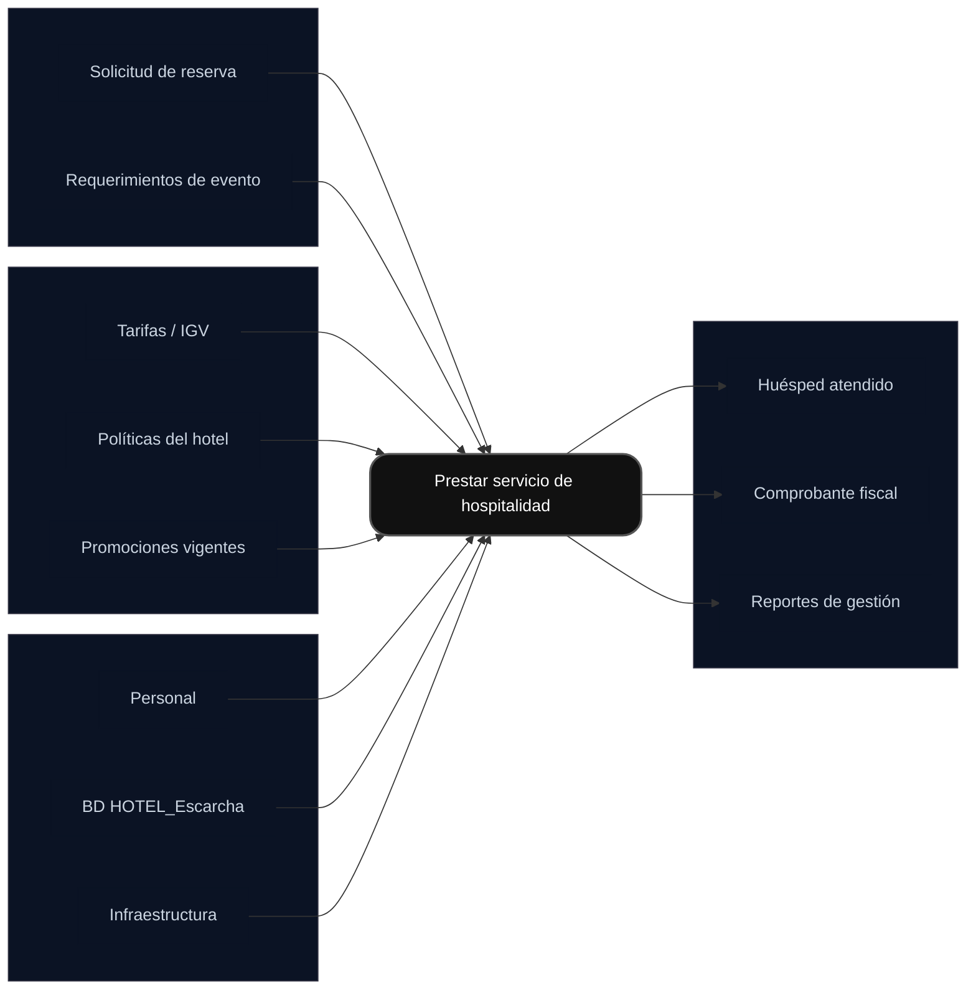

```mermaid
flowchart LR
  %% ====== ESTILO ======
  classDef centro fill:#111,stroke:#555,stroke-width:2,color:#fff,rx:18,ry:18;
  classDef grupo fill:#0b1324,stroke:#334,stroke-width:1,color:#cbd5e1;
  classDef etiqueta fill:#0b1324,stroke:#0b1324,color:#cbd5e1;

  %% ====== BLOQUE CENTRAL ======
  A0["Prestar servicio de hospitalidad"]:::centro

  %% ====== INPUTS (I) IZQUIERDA ======
  subgraph I[ ]
  direction TB
  I1["Solicitud de reserva"]:::etiqueta
  I2["Requerimientos de evento"]:::etiqueta
  end
  class I grupo
  I1 --> A0
  I2 --> A0

  %% ====== CONTROLES (C) ARRIBA ======
  subgraph C[ ]
  direction LR
  C1["Tarifas / IGV"]:::etiqueta
  C2["Políticas del hotel"]:::etiqueta
  C3["Promociones vigentes"]:::etiqueta
  end
  class C grupo
  C1 --> A0
  C2 --> A0
  C3 --> A0

  %% ====== SALIDAS (O) DERECHA ======
  subgraph O[ ]
  direction TB
  O1["Huésped atendido"]:::etiqueta
  O2["Comprobante fiscal"]:::etiqueta
  O3["Reportes de gestión"]:::etiqueta
  end
  class O grupo
  A0 --> O1
  A0 --> O2
  A0 --> O3

  %% ====== MECANISMOS (M) ABAJO ======
  subgraph M[ ]
  direction LR
  M1["Personal"]:::etiqueta
  M2["BD HOTEL_Escarcha"]:::etiqueta
  M3["Infraestructura"]:::etiqueta
  end
  class M grupo
  M1 --> A0
  M2 --> A0
  M3 --> A0
```
