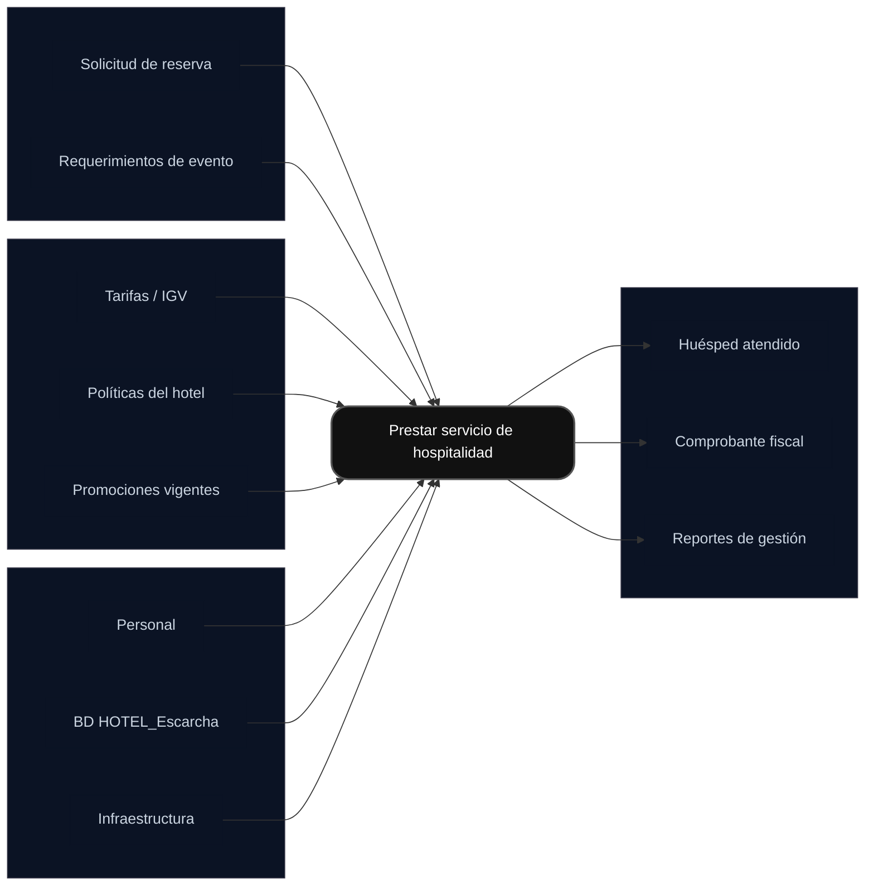
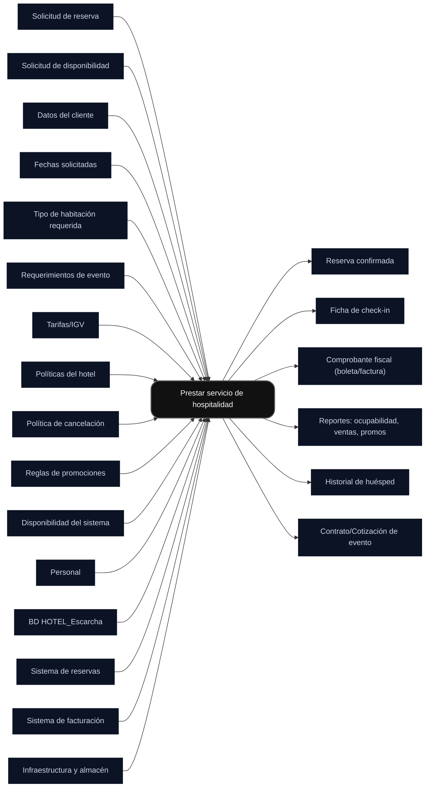
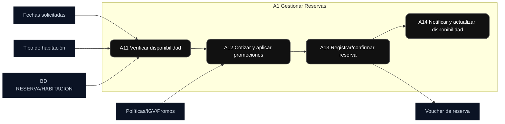

```mermaid
flowchart LR
  %% ====== ESTILO ======
  classDef centro fill:#111,stroke:#555,stroke-width:2,color:#fff,rx:18,ry:18;
  classDef grupo fill:#0b1324,stroke:#334,stroke-width:1,color:#cbd5e1;
  classDef etiqueta fill:#0b1324,stroke:#0b1324,color:#cbd5e1;

  %% ====== BLOQUE CENTRAL ======
  A0["Prestar servicio de hospitalidad"]:::centro

  %% ====== INPUTS (I) IZQUIERDA ======
  subgraph I[ ]
  direction TB
  I1["Solicitud de reserva"]:::etiqueta
  I2["Requerimientos de evento"]:::etiqueta
  end
  class I grupo
  I1 --> A0
  I2 --> A0

  %% ====== CONTROLES (C) ARRIBA ======
  subgraph C[ ]
  direction LR
  C1["Tarifas / IGV"]:::etiqueta
  C2["Políticas del hotel"]:::etiqueta
  C3["Promociones vigentes"]:::etiqueta
  end
  class C grupo
  C1 --> A0
  C2 --> A0
  C3 --> A0

  %% ====== SALIDAS (O) DERECHA ======
  subgraph O[ ]
  direction TB
  O1["Huésped atendido"]:::etiqueta
  O2["Comprobante fiscal"]:::etiqueta
  O3["Reportes de gestión"]:::etiqueta
  end
  class O grupo
  A0 --> O1
  A0 --> O2
  A0 --> O3

  %% ====== MECANISMOS (M) ABAJO ======
  subgraph M[ ]
  direction LR
  M1["Personal"]:::etiqueta
  M2["BD HOTEL_Escarcha"]:::etiqueta
  M3["Infraestructura"]:::etiqueta
  end
  class M grupo
  M1 --> A0
  M2 --> A0
  M3 --> A0
```
-----

```mermaid
flowchart LR
  classDef centro fill:#111,stroke:#555,stroke-width:2,color:#fff,rx:18,ry:18;
  classDef tag fill:#0b1324,stroke:#0b1324,color:#cbd5e1;

  A0["Prestar servicio de hospitalidad"]:::centro

  %% Inputs (columna izquierda)
  I1["Solicitud de reserva"]:::tag --> A0
  I2["Solicitud de disponibilidad"]:::tag --> A0
  I3["Datos del cliente"]:::tag --> A0
  I4["Fechas solicitadas"]:::tag --> A0
  I5["Tipo de habitación requerida"]:::tag --> A0
  I6["Requerimientos de evento"]:::tag --> A0

  %% Controles (arriba)
  C1["Tarifas/IGV"]:::tag --> A0
  C2["Políticas del hotel"]:::tag --> A0
  C3["Política de cancelación"]:::tag --> A0
  C4["Reglas de promociones"]:::tag --> A0
  C5["Disponibilidad del sistema"]:::tag --> A0

  %% Outputs (derecha)
  A0 --> O1["Reserva confirmada"]:::tag
  A0 --> O2["Ficha de check-in"]:::tag
  A0 --> O3["Comprobante fiscal (boleta/factura)"]:::tag
  A0 --> O4["Reportes: ocupabilidad, ventas, promos"]:::tag
  A0 --> O5["Historial de huésped"]:::tag
  A0 --> O6["Contrato/Cotización de evento"]:::tag

  %% Mechanisms (abajo)
  M1["Personal"]:::tag --> A0
  M2["BD HOTEL_Escarcha"]:::tag --> A0
  M3["Sistema de reservas"]:::tag --> A0
  M4["Sistema de facturación"]:::tag --> A0
  M5["Infraestructura y almacén"]:::tag --> A0
```
----

```mermaid
flowchart LR
  classDef caja fill:#111,stroke:#555,stroke-width:2,color:#fff,rx:12,ry:12;
  classDef tag fill:#0b1324,stroke:#0b1324,color:#cbd5e1;

  subgraph A1["A1 Gestionar Reservas"]
  direction LR
    A11["A11 Verificar disponibilidad"]:::caja --> A12["A12 Cotizar y aplicar promociones"]:::caja --> A13["A13 Registrar/confirmar reserva"]:::caja --> A14["A14 Notificar y actualizar disponibilidad"]:::caja
  end

  %% ICOM
  I1["Fechas solicitadas"]:::tag --> A11
  I2["Tipo de habitación"]:::tag --> A11
  C1["Políticas/IGV/Promos"]:::tag --> A12
  A13 --> O1["Voucher de reserva"]:::tag
  M1["BD RESERVA/HABITACION"]:::tag --> A11

```
