```mermaid
flowchart LR
  %% ==========================================
  %% HOTEL ESCARCHA - MACRO FLUJO (GITHUB SAFE)
  %% ==========================================

  %% Actores / contexto
  subgraph C0 ["Cliente"]
    C1["Inicio"]
    C2["Solicitud de reserva"]
    C3["Datos del cliente"]
  end

  subgraph FD ["Front Desk / Recepción"]
    R1["Validar disponibilidad"]
    R2{"¿Hay cupo?"}
    R3["Registrar RESERVA"]
    R4["Enviar confirmación (voucher)"]
    R5["Registrar CHECK-IN"]
    R6["Registrar CHECK-OUT"]
  end

  subgraph OPS ["Operación de Alojamiento"]
    A1["Asignar habitación"]
    A2["Atender huésped / Room service"]
    A3["Generar cargos de alojamiento"]
  end

  subgraph REST ["Restaurante / Bar"]
    B1["Tomar COMANDA"]
    B2["Preparar y entregar pedido"]
    B3["Generar cargos de restaurante"]
  end

  subgraph EVT ["Eventos y Salones"]
    E1["Programar evento (RESERVA_SALON)"]
    E2["Montaje y atención"]
    E3["Generar cargos de evento"]
  end

  subgraph CAJA ["Facturación y Cobro"]
    F0["Acumular cargos → ORDEN_VENTA"]
    F1{"¿Aplica PROMOCIÓN?"}
    F2["Calcular descuento (ORDEN_PROMOCION)"]
    F3["Emitir COMPROBANTE (Boleta/Factura)"]
    F4{"¿Pago aprobado?"}
    F5["Registrar PAGO (POS/Efectivo)"]
    F6["Entregar voucher / factura"]
  end

  subgraph INV ["Inventario / Compras / Mantenimiento"]
    I1["Salida de insumos (MOV_INVENTARIO S)"]
    I2{"¿Reposición requerida?"}
    I3["Orden de Compra (OC / DET_OC)"]
    I4["Entrada a almacén (MOV_INVENTARIO E)"]
    I5["Orden de Trabajo de Mantenimiento"]
  end

  subgraph REP ["Reportes / Control"]
    X1["Reporte de Ocupabilidad"]
    X2["Reporte de Ventas por fuente"]
    X3["Kardex / Stock"]
    X4["Historial del huésped"]
  end

  %% Flujos principales
  C1 --> C2 --> C3 --> R1
  R1 --> R2
  R2 -- "No" --> C1
  R2 -- "Sí" --> R3 --> R4 --> R5

  R5 --> A1 --> A2 --> A3 --> F0

  %% Restaurante y eventos (paralelo)
  R5 -. consumo .-> B1
  B1 --> B2 --> B3 --> F0

  R5 -. servicios .-> E1
  E1 --> E2 --> E3 --> F0

  %% Check-out dispara cierre
  R6 --> F0

  %% Promociones y cobro
  F0 --> F1
  F1 -- "Sí" --> F2 --> F3
  F1 -- "No" --> F3
  F3 --> F4
  F4 -- "Aprobado" --> F5 --> F6
  F4 -- "Rechazado" --> F3

  %% Inventario ligado a consumos
  B2 --> I1
  I1 --> I2
  I2 -- "Sí" --> I3 --> I4
  I2 -- "No" --> I5

  %% Salidas a reportes
  R3 --> X1
  R5 --> X1
  F3 --> X2
  I1 --> X3
  I4 --> X3
  R6 --> X4

```

----

------

-----
```mermaid

%% A0 – Prestar un buen servicio de hospitalidad (A1…A7 + I,C,O,M)
flowchart LR
  classDef f fill:#0b1324,stroke:#3b4454,stroke-width:1.2,color:#fff,rx:10,ry:10,font-size:12px;
  classDef i fill:#0b3a74,stroke:#335d92,color:#fff,rx:6,ry:6,font-size:11px;
  classDef c fill:#1c6b2a,stroke:#2a8f3b,color:#fff,rx:6,ry:6,font-size:11px;
  classDef o fill:#3b3b3b,stroke:#666,color:#fff,rx:6,ry:6,font-size:11px;
  classDef m fill:#5b5b5b,stroke:#888,color:#fff,rx:6,ry:6,font-size:11px;
  classDef ghost stroke-dasharray:3 3,fill:#0000,stroke:#666,color:#999;

  %% ---- Filas de funciones (A1..A7)
  subgraph A0["A0 – Prestar un buen servicio de hospitalidad"]
  direction TB

  %% fila principal
  A1["A1 Gestionar Reservas"]:::f
  A2["A2 Check-in / Check-out"]:::f
  A3["A3 Alojamiento y Servicios"]:::f
  A6["A6 Facturar y Cobrar"]:::f
  A7["A7 Inventario y Mantenimiento"]:::f

  %% fila secundaria
  A4["A4 Restaurante / Bar"]:::f
  A5["A5 Eventos y Salones"]:::f

  %% orden visual
  A1 --> A2 --> A3 --> A6 --> A7
  A2 --> A4 --> A6
  A2 --> A5 --> A6
  end

  %% ---- Inputs globales (I)
  subgraph I["Inputs (I)"]
  direction TB
  I1["I1 Solicitud de reserva"]:::i
  I2["I2 Datos del cliente"]:::i
  I3["I3 Requerimiento de evento"]:::i
  I4["I4 Cotización solicitada"]:::i
  I5["I5 Fechas solicitadas"]:::i
  I6["I6 Tipo de habitación"]:::i
  I7["I7 Pedido/consumo (rest.)"]:::i
  end

  %% ---- Controles (C)
  subgraph C["Controles (C)"]
  direction TB
  C1["C1 Tarifas / IGV / SUNAT"]:::c
  C2["C2 Políticas de hotel (cancel., registro, horarios)"]:::c
  C3["C3 Promociones vigentes"]:::c
  C4["C4 Estándares de servicio e inocuidad"]:::c
  C5["C5 Regl. de eventos / tarifario por hora"]:::c
  C6["C6 Políticas de stock / plan de mantto."]:::c
  end

  %% ---- Outputs (O)
  subgraph O["Outputs (O)"]
  direction TB
  O1["O1 Reserva confirmada"]:::o
  O2["O2 Huésped registrado / check-out"]:::o
  O3["O3 Consumos y cargos (hab., rest., evento)"]:::o
  O4["O4 Comprobante fiscal / voucher / cierre de caja"]:::o
  O5["O5 Reposición/OT / Kardex actualizado"]:::o
  end

  %% ---- Mecanismos (M)
  subgraph M["Mecanismos (M)"]
  direction TB
  M1["M1 Personal (recepción, caja, cocina, eventos, mantto.)"]:::m
  M2["M2 Sistema de reservas / PMS"]:::m
  M3["M3 Sistema de facturación / POS"]:::m
  M4["M4 BD HOTEL_Escarcha"]:::m
  M5["M5 Infraestructura / salones / almacén / equipos"]:::m
  end

  %% Conexiones I -> funciones
  I1 --> A1
  I2 --> A1
  I4 --> A1
  I5 --> A1
  I6 --> A1

  O1 --> A2    %% (reserva confirmada desde A1, aquí lo mostramos como I/O puente)
  I3 --> A5
  I7 --> A4

  %% Controles (arriba)
  C1 --> A1
  C1 --> A6
  C2 --> A2
  C2 --> A3
  C3 --> A1
  C4 --> A3
  C4 --> A4
  C5 --> A5
  C6 --> A7

  %% Outputs de funciones a bloque de O
  A1 --> O1
  A2 --> O2
  A3 --> O3
  A4 --> O3
  A5 --> O3
  A6 --> O4
  A7 --> O5

  %% Mecanismos (abajo)
  M1 --> A2
  M1 --> A3
  M1 --> A4
  M1 --> A5
  M1 --> A6
  M1 --> A7
  M2 --> A1
  M2 --> A2
  M3 --> A6
  M3 --> A4
  M4 --> A1
  M4 --> A2
  M4 --> A6
  M5 --> A3
  M5 --> A4
  M5 --> A5
  M5 --> A7


```
